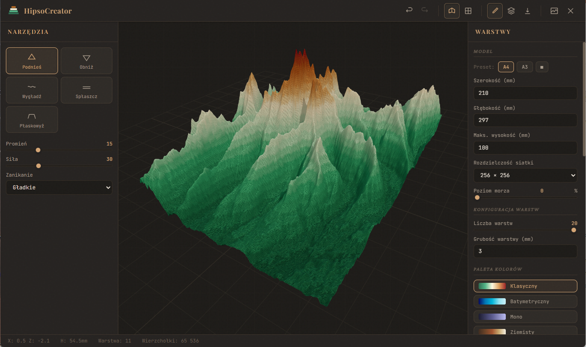
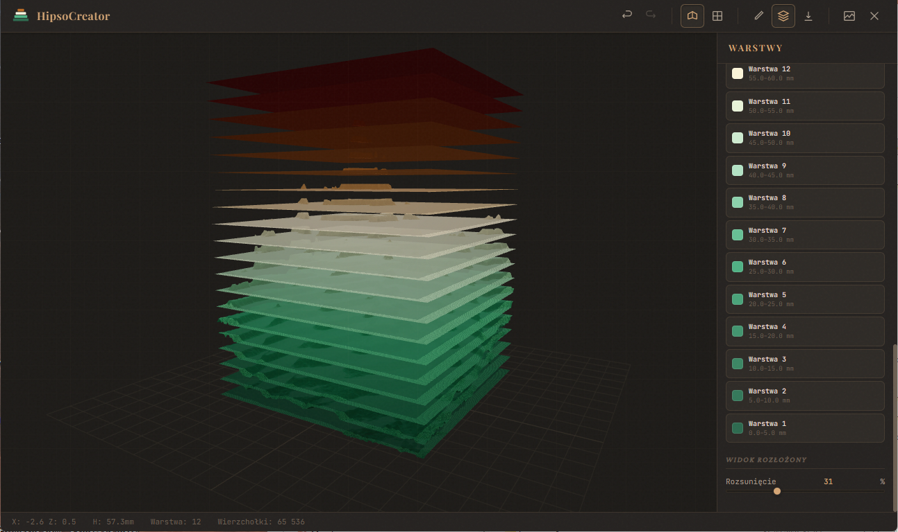

# 🏔️ HipsoCreator — Edytor Terenu 3D

> **[🌐 Live Demo](https://gierson.github.io/HipsoCreator/)**

Interaktywny edytor terenu 3D do tworzenia warstwowych modeli hipsometrycznych. Wyrzeźb teren w przeglądarce, skonfiguruj warstwy kolorystyczne, a następnie wyeksportuj kontury do PDF/PNG — gotowe szablony do wycięcia i złożenia fizycznego modelu terenu.




---

## 🛠️ Technologie

- **Vite** + **TypeScript** — bundler i typowanie
- **Three.js** — rendering 3D w przeglądarce
- **jsPDF** — generowanie wielostronicowych PDF

---

## 🚀 Uruchomienie

### Wymagania
- **Node.js** ≥ 18
- **npm** ≥ 9

### Instalacja i start

```bash
# Sklonuj repozytorium
git clone <url-repo>
cd hipsometria

# Zainstaluj zależności
npm install

# Uruchom serwer deweloperski
npm run dev
```

Aplikacja otworzy się pod adresem **http://localhost:5173/** (lub kolejny wolny port).

### Build produkcyjny

```bash
npm run build
npm run preview
```

---

## 📖 Instrukcja użytkowania

### Interfejs

Aplikacja składa się z trzech głównych paneli:

| Element | Opis |
|---|---|
| **Toolbar** (góra) | Undo/redo, przełączanie widoku, tryby pracy, import/reset |
| **Panel lewy** | Narzędzia rzeźbienia z parametrami |
| **Viewport** (centrum) | Podgląd 3D terenu na siatce milimetrowej |
| **Panel prawy** | Konfiguracja modelu, warstw i kolorów |
| **Status bar** (dół) | Pozycja kursora, wysokość, warstwa, liczba wierzchołków |

---

### 1. Rzeźbienie terenu

**Sterowanie:**
- **Lewy przycisk myszy** — rzeźbienie (malowanie narzędziem na terenie)
- **Prawy przycisk myszy** — obracanie widoku
- **Scroll** — zoom

**Narzędzia** (panel lewy):

| Narzędzie | Działanie |
|---|---|
| ▲ Podnieś | Podnosi teren w miejscu kursora |
| ▼ Obniż | Obniża teren |
| ~ Wygładź | Uśrednia nierówności |
| ─ Spłaszcz | Wyrównuje do poziomu punktu centralnego |
| ⊓ Płaskowyż | Tworzy płaską powierzchnię na danej wysokości |

**Parametry narzędzia:**
- **Promień** (1–50) — rozmiar pędzla
- **Siła** (1–100) — intensywność oddziaływania
- **Zanikanie** — sposób osłabiania efektu od centrum (gładkie / liniowe / ostre)

---

### 2. Konfiguracja modelu (panel prawy)

- **Szerokość / Głębokość (mm)** — wymiary fizyczne modelu
- **Maks. wysokość (mm)** — najwyższy punkt terenu
- **Rozdzielczość siatki** — 64×64 / 128×128 / 256×256 wierzchołków
- **Poziom morza (%)** — suwak ustawiający linię brzegową; poniżej — woda (kolor niebieski)

---

### 3. Konfiguracja warstw

- **Liczba warstw** (2–20) — na ile warstw pociąć model
- **Grubość warstwy (mm)** — fizyczna grubość każdej warstwy
- **Paleta kolorów** — wybierz preset:
  - 🟢 Klasyczny (zieleń → brąz → biały)
  - 🔵 Batymetryczny (odcienie niebieskiego)
  - 🟣 Mono (jednokolorowy gradient)
  - 🟤 Ziemisty (brązy i ochry)
- **Lista warstw** — kliknij próbkę koloru, aby zmienić kolor danej warstwy

---

### 4. Tryby pracy (toolbar)

| Ikona | Tryb | Opis |
|---|---|---|
| ✏️ | **Rzeźbienie** | Edycja terenu narzędziami |
| 📐 | **Podgląd warstw** | Widok rozłożony (exploded view) z suwakiem rozsunięcia |
| ⬇️ | **Eksport** | Otwiera modal eksportu |

---

### 5. Eksport

Kliknij przycisk **Eksport** w toolbarze. Modal pozwala skonfigurować:

- **Format** — PDF (wielostronicowy) lub PNG (osobne pliki)
- **Rozmiar papieru** — A4 / A3
- **Skala** — 1:1 (wymiary w mm) lub dopasuj do strony
- **Siatka w tle** — opcjonalna siatka milimetrowa

**Co zawiera każda strona/plik:**
- Kontur warstwy (bez wypełnienia) — gotowy do wycięcia
- Próbka koloru z kodem hex w prawym dolnym rogu
- Numer warstwy i zakres wysokości w lewym dolnym rogu
- Znaczniki wyrównania (crosshair) w rogach
- Numer strony (w PDF)

---

### 6. Import heightmap

Kliknij ikonę importu w toolbarze i załaduj obraz grayscale (PNG/JPG). Jasność pikseli mapowana jest na wysokość terenu — czarny = minimum, biały = maksimum.

---

### 7. Skróty klawiszowe

| Skrót | Akcja |
|---|---|
| `Ctrl + Z` | Cofnij |
| `Ctrl + Y` | Ponów |

---

## 📂 Struktura projektu

```
src/
├── main.ts                    # Entry point, orkiestrator UI
├── style.css                  # Design system ("Cartographic Workshop")
├── scene/
│   └── SceneManager.ts        # Three.js scena, kamera, światła
├── terrain/
│   ├── TerrainMesh.ts         # Siatka terenu z kolorowaniem warstw
│   ├── TerrainEditor.ts       # Narzędzia rzeźbienia + raycasting
│   └── HeightmapLoader.ts     # Import obrazu grayscale
├── layers/
│   └── LayerExporter.ts       # Eksport PDF/PNG
└── utils/
    ├── MarchingSquares.ts     # Algorytm konturów 2D
    ├── UndoManager.ts         # Historia operacji (undo/redo)
    └── ColorPresets.ts        # Palety kolorów hipsometrycznych
```

---

## 📄 Licencja

MIT
